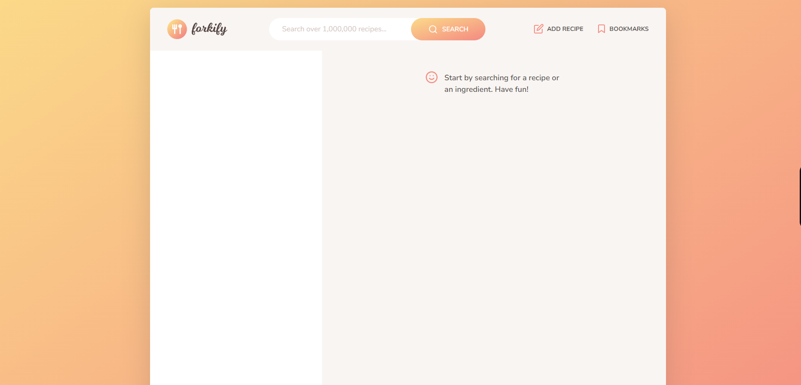
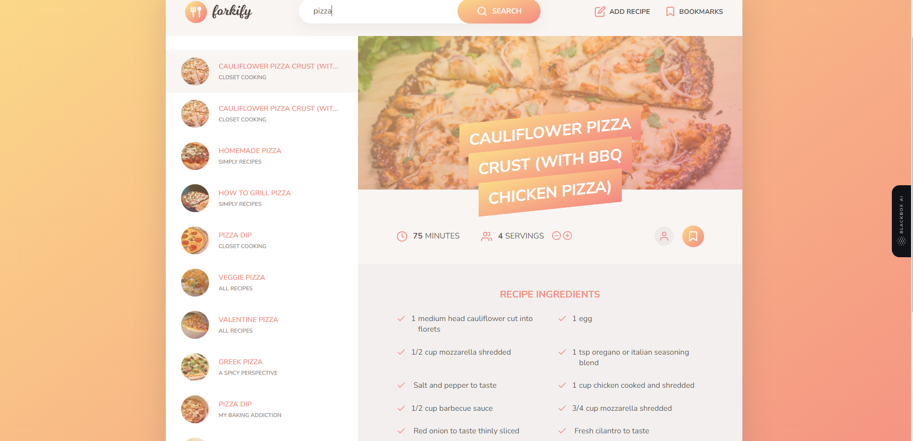
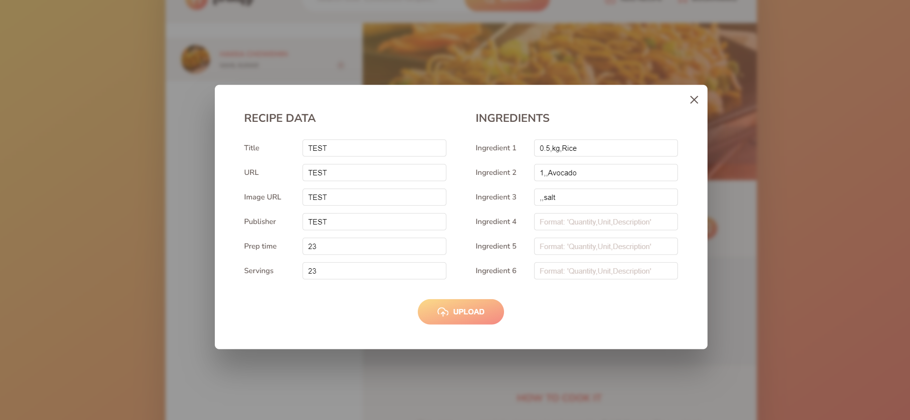
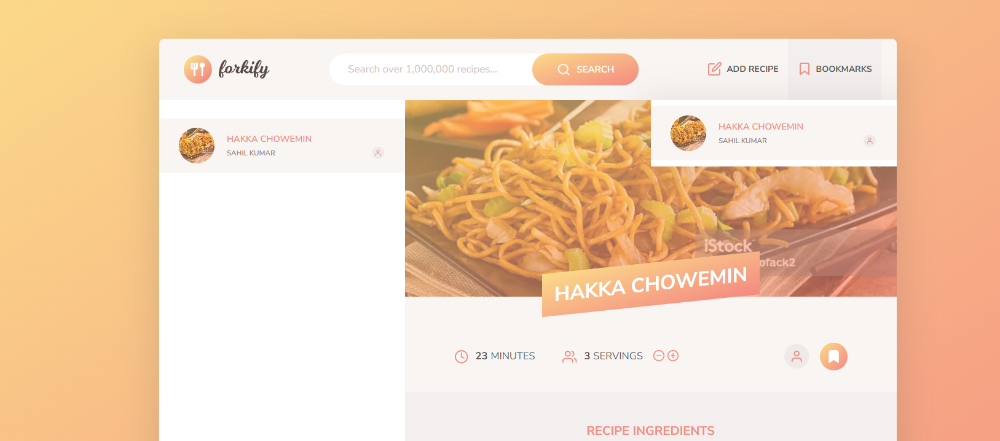

# Frorkify

## Description
This web application allows users to discover various types of recipes and empowers them to create and share their own unique recipes. Users can search for recipes based on ingredients, dietary preferences, or cuisine, and they can also contribute their own recipes to the platform.

## Check the website <a href="https://frokify-sahil.netlify.app/">Link</a>

## 💻 Built with
Technologies used in the project:

*   HTML
*   CSS
*   JS

<h2>Project Screenshots:</h2>

  

## Features
- *Recipe Search:* Users can search for recipes using keywords, ingredients, cuisine types, or dietary preferences.

- *Recipe Listing:* Display search results with recipe cards, including images, titles, and a brief description.

- *Recipe Details:* Users can click on a recipe card to view detailed information, including ingredients, preparation steps, cooking time, and nutritional information.

- *Recipe Submission:* Registered users can submit their own recipes, including images, ingredients, preparation steps, and additional details.

- *Recipe Rating and Reviews (Optional):* Enable users to rate and leave reviews for recipes.

- *Responsive Design:* Ensure the application is accessible and usable on various devices, including desktops, tablets, and smartphones.
